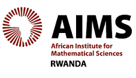
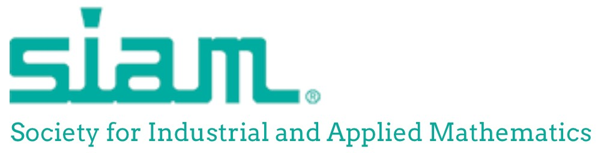
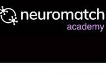



<!-- 

  

    
  

 -->




CV in [PDF](/archive/CV_Ariel-Ghislain-Kemogne-Kamdoum.pdf) version.

---

# Education
---

<table style="width:100%">
<col width="9%">
<col width="20">
<col >

<tr style="border-bottom:1pt solid #eee">
<td markdown="1">

</td>
<td></td>
<td markdown="1">
[**University of Calgary, Canada**](https://www.ucalgary.ca/), 01/2022 - 01/2026 
- **Ph.D in Biostatistics**
- Supervisor: [Dr. Quan Long](https://cumming.ucalgary.ca/departments/bmb/profiles/dr-quan-long)
</td> 
</tr>

<tr style="border-bottom:1pt solid #eee">
<td markdown="1">

</td>
<td></td>
<td markdown="1">
[**The University of Ghana, (African Master In Machine Intelligence (AMMI, Ghana)**](https://www.ug.edu.gh/), 10/2019 - 10/2020 
- **Msc in Machine Intelligence**
- Supervisor: [Dr. Moustapha Cisse](https://nexteinstein.org/person/moustapha-cisse/)
- Thesis: Optimization and Generalization of Shallow Neural Networks with Quadratic Activation Functions
- *Full scolarship by Facebook and Google, [AMMI](https://aimsammi.org/)*
</td> 
</tr>

<tr style="border-bottom:1pt solid #eee">
<td markdown="1">

</td>
<td></td>
<td markdown="1">
[**The African Institute for Mathematical Sciences, (AIMS Senegal)**](https://aims-senegal.org/), 08/2018 - 06/2019 
- **Msc in Mathematical Sciences**
- Supervisor: Dr. Andre Saint Eudes MIALEBAMA BOUESSO, PhD, Marien Ngouabi University, Brazzaville , Congo
- Thesis: Abelian extension and crossed module for Lie algebras
- *Full scolarship by MasterCard Foundation, [AIMS Senegal](https://aims-senegal.org/)*
</td> 
</tr>

<tr height="10"/>
<tr style="border-bottom:1pt solid #eee">
<td markdown="1">

</td>
<td></td>
<td markdown="1">
[**University of Dschang**](https://www.univ-dschang.org/), 2012 - 2016
- **Bsc in Mathematics and Computer Science**
</td> 
</tr>

<tr height="10"/>
<tr style="border-bottom:1pt solid #eee">
<td markdown="1">

</td>
<td></td>
<td markdown="1">
[**University of Dschang**](https://www.univ-dschang.org/), 2016 - 2018
- **Master's degree in Mathematics**
- Supervisor: Dr. Calvin Tcheka
- Thesis: (Co)homologie des espaces de configuration
</td> 
</tr>

</table>

---

# Skills
---

#### Programming

- Python
- R
- C/C++
- Java
- Matlab/Octave

  

#### Libraries

- PyTorch
- TensorFlow
- Sklearn

  

#### Tools

- Git 
- LaTeX

#### Language

- English(Fluent)
- French(Fluent)
  

---

---

# Conferences and Workshops 
---
<table style="width:100%">
<col width="17%">
<col width="20">
<col >

<tr style="border-bottom:1pt solid #eee">
<td markdown="1">

</td>
<td></td>
<td markdown="1">
[CIMPA (Centre International des Mathématiques Pures et Appliquées)](https://icadl.net/icadl2021/](https://www.cimpa.info/), Ecole Nationale Supérieure Polytechnique de Yaoundé, Cameroon (2018)
-Title: Application of ALgebraic Toplogy in Robotics
  
The Centre International de Mathématiques Pures et Appliquées (CIMPA), founded in France in 1978, is a nonprofit organisation that promotes research in Mathematics in developing countries. Located in Nice, it is a UNESCO Category 2 centre and  is part of the Laboratoire d'Excellence CARMIN (Centres d'Accueil et de Rencontres Mathématiques Internationales). It benefits from the financial support of Germany, France, Norway, Spain and Switzerland.
</td> 
</tr>
  
<tr style="border-bottom:1pt solid #eee">
<td markdown="1">

</td>
<td></td>
<td markdown="1">
[Heidelberg Laureate Forum (HLF)](https://www.heidelberg-laureate-forum.org/), 7th Heidelberg Laureate Forum, Germany (2019)

The HLF is a networking conference where 200 carefully selected young researchers in mathematics and computer science spend a week interacting with the laureates of the disciplines: recipients of the Abel Prize, ACM A.M. Turing Award, ACM Prize in Computing, Fields Medal and Nevanlinna Prize. Established in 2013, the HLF is annually organized by the Heidelberg Laureate Forum Foundation (HLFF)
</td> 
</tr>

<tr style="border-bottom:1pt solid #eee">
<td markdown="1">

</td>
<td></td>
<td markdown="1">
[“Future of science” conference](https://fosc.nexteinstein.org/participants/), Kigali, Rwanda (2019) 

</td> 
</tr>
  
<tr style="border-bottom:1pt solid #eee">
<td markdown="1">

</td>
<td></td>
<td markdown="1">
[11th Gene Golub SIAM Summer School](https://sites.google.com/aims.ac.za/g2s3-aims-2021/people?authuser=0), on “Theory and Practice of Deep Learning”, Cape Twon, South Africa 

</td> 
</tr>  

<tr style="border-bottom:1pt solid #eee">
<td markdown="1">

</td>
<td></td>
<td markdown="1">
[Heidelberg Laureate Forum (HLF)](https://www.heidelberg-laureate-forum.org/), 8th Heidelberg Laureate Forum, Germany (2021)

The HLF is a networking conference where 200 carefully selected young researchers in mathematics and computer science spend a week interacting with the laureates of the disciplines: recipients of the Abel Prize, ACM A.M. Turing Award, ACM Prize in Computing, Fields Medal and Nevanlinna Prize. Established in 2013, the HLF is annually organized by the Heidelberg Laureate Forum Foundation (HLFF)
</td> 
</tr>
</table>

---

# Work Experiences

---

<table style="width:100%">
<col width="17%">
<col width="20">
<col >

<table style="width:100%">
<col width="17%">
<col width="20">
<col >

<table style="width:100%">
<col width="17%">
<col width="20">
<col >
<tr style="border-bottom:1pt solid #eee">
<td markdown="1">
<!--  -->

</td>
<td></td>
<td markdown="1">
[**University of Calgary**](https://www.ucalgary.ca/), 2022 - Now 
- Graduate Teaching Assistant, Faculty of Medicine and Dept of Mathematics and Statistics:
GA(T)s are appointed to provide teaching or instructional service, which might encompass lecturing assistance, laboratory supervision, office hours, grading assignments, tutorial direction, assistance in preparation of demonstration and instructional aids, and other related academic duties. 
</td> 
</tr>

<table style="width:100%">
<col width="17%">
<col width="20">
<col >
<tr style="border-bottom:1pt solid #eee">
<td markdown="1">

</td>
<td></td>
<td markdown="1">
[**Neuromatch Academy (NMA)**](https://academy.neuromatch.io/), 2022 - Now 
- Production Team Member & Teaching Assistant in Deep Learning - Neuroscience
Neuromatch Academy is a massive, interactive, online summer school experience spanning from hands-on modeling experience to meta-science interpretation skills across just about everything that could be reasonably included in the labels "computational neuroscience" and “deep learning”.
Having substantial expertise in Python and experience with some aspects of neural data analysis and deep learning, I was working closely with a given pod for three weeks to help students solve problems and guide group projects.  
</td> 
</tr>

<table style="width:100%">
<col width="17%">
<col width="20">
<col >

<table style="width:100%">
<col width="17%">
<col width="20">
<col >
<tr style="border-bottom:1pt solid #eee">
<td markdown="1">

</td>
<td></td>
<td markdown="1">
[**ICRISAT/MANOBI AFRICA**](http://www.manobi.com/), 2021 - 2022 
- Data Scientist 
</td> 
</tr>

<tr height="10"/>
<tr style="border-bottom:1pt solid #eee">
<td markdown="1">
<!--  -->

</td>
<td></td>
<td markdown="1">
[University of Dschang, Cameroon](https://www.univ-dschang.org/), 2016 - 2018 
- Teaching Assistant in Mathematics
</td> 
</tr>

</table>

