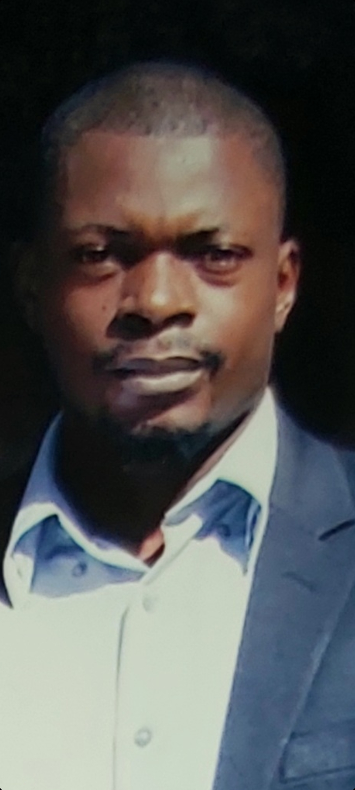



  

    
  

  <h1>
    Homepage
     <small>{{ site.tagline }}</small>
  </h1>

### About Me
I am Ariel Ghislain Kemogne Kamdoum. Currently pursuing my PhD studies in Biostatistics at the [University of Calgary](https://www.ucalgary.ca/) in the Department of Mathematics and Statistics and in collaboration with the Faculty of Medecine and the Department of Biochemistry & Molecular
Biology,I am working on developing machine learning models and applying them to biological/medical data. My research basically focuses on novel biostatistical and machine learning methods for identifying genetic factors associated with complex diseases such as cancer and cardiovascular diseases.
 
Indeed, I have a background in mathematics and computer science with a specialization in machine intelligence, as I have a Master's degree in mathematics from the [University of Dschang, Cameroon](https://www.univ-dschang.org/), where I worked in the Algebraic Topology field, specifically on the following topic: “(Co)Homology of Configuration Spaces”, where I was able to show that there exist an algorithm that allow us to compute the (co)homology groups of configuration spaces generated by a certain given topological space. This result has an incredible application in robotic, because it allows us to find a path for a given robot going from an initial point A to a final point B, just by knowing a different (co)homology groups and topology of its configuration spaces associated. In regard of the beauty of Mathematical Sciences and what it does in applied domains, I was more and more motivated to
know more about and improving my knowledge. That is why after completing my Master’s degree in mathematics at Dschang University in Cameroon, I joined both the [African Institute for Mathematical Sciences (AIMS) in Senegal](https://aims-senegal.org/) in 2018, where I got my Msc in Mathematical Sciences, and the [African Institute for Mathematical Sciences (AIMS) in Ghana](https://aims.edu.gh/) in 2019, where I received my Msc in Machine Intelligence in 2021 on the following research topic: "Optimization and Generalization of Shallow Neural Networks with Quadratic Activation Functions", from the master program [African Master in Machine Intelligence](https://aimsammi.org/) (AMMI), sponsored by Facebook and Google. 

To conclude, having also several working experiences in companies as I worked as a data scientist at [ICRISAT/MANOBI](https://www.manobi.com/), where using data intelligence for delivering digital solutions, services for businesses, development projects, service providers in Africa’s water and agricultural sectors on providing robust monitoring and evaluation reports, and sustainable management solutions, and as I worked as a production team member and teaching assistant in deep learning and neuroscience at [Neuromatch Academy (NMA)](https://academy.neuromatch.io/), I am passionate about applying mathematics(statistics) and computer science(machine intelligence) to solve real life problems. So, currently a member of the [Quan Long's Lab](https://sites.google.com/site/quanlongresearch/home?authuser=0) at the [University of Calgary](https://www.ucalgary.ca/) in Canada, while doing my PhD in Biostatistics, I am so excited to provided amazing and impactful results in the field.

---

### Research Interests
My research interests include but not limited to:

- Biostatistics

- Statistics

- Machine learning

- Computer vision

- Deep learning

- Optimization

- Bioinformatics

- Mathematical modelling

---

### Talks and Presentations
- [Accelerating Stochastic Gradient Descent using Predictive Variance Reduction](https://proceedings.neurips.cc/paper/2013/file/ac1dd209cbcc5e5d1c6e28598e8cbbe8-Paper.pdf), Gene Golub SIAM Summer School, Cape Town, South Africa, 2021
&nbsp;&nbsp;&nbsp;&nbsp;&nbsp;[Ref](https://sites.google.com/aims.ac.za/g2s3-aims-2021/groups?authuser=0).

- [Abelian extension and crossed module for Lie algebras](https://arxiv.org/abs/1802.04061), African Institute for Mathematical Sciences(AIMS), Dakar, Senegal, 2019 

---

### News
- [January 2022] Thrilled to announce that I joined the [University of Calgary](https://www.ucalgary.ca/) in Canada, the @Quan_Long's_lab and I started my PhD in the Department of Mathematics and Statistics and in collaboration with the Faculty of Medecine and the Department of Biochemistry & Molecular Biology

- [July 2021] I participe at the [11th Gene Golub SIAM Summer School](https://sites.google.com/aims.ac.za/g2s3-aims-2021/people?authuser=0), on “Theory and Practice of Deep Learning”, Cape Twon, South Africa

- [September 2021] I am participating at the 8th Heidelberg Laureate Forum, in digital due to the Covid-19 pandemic 

- [December 2020] I competed my Msc program in Machine Intelligence from the African Masters of Machine Intelligence in Ghana

- [July 2019] I am taking part of the [“Future of science” conference](https://fosc.nexteinstein.org/participants/), Kigali, Rwanda 

- [September 2019] I am participating in the 7th Heidelberg Laureate Forum, Heidelberg, Germany

- [July 2018] I completed my Master's degree in Mathematics from the [University of Dschang, Cameroon](https://www.univ-dschang.org/)

- [April 2018] I participated at CIMPA (Centre International des Mathématiques Pures et Appliquées) at Ecole Nationale Supérieure Polytechnique de Yaoundé, Cameroon

---

### Contacts
- Email: arielghislain.kemogn@ucalgary.ca
