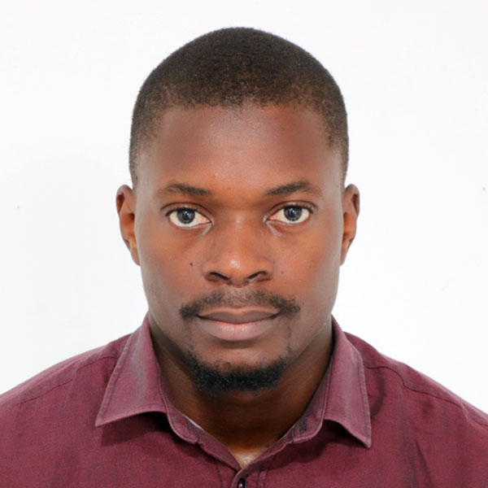



  

    
  

  <h1>
    Homepage
     <small>{{ site.tagline }}</small>
  </h1>

### About Me

I'm Ariel Ghislain Kemogne Kamdoum, a PhD student in Biostatistics at the [University of Calgary, Canada](https://www.ucalgary.ca/), specializing in machine learning applications in biological and medical data. My research primarily involves developing novel biostatistical and machine learning methodologies to identify genetic factors linked to complex diseases like cancer and cardiovascular conditions.

My academic foundation is in Mathematics and Computer Science, with a focus on Machine Intelligence. I completed my Master's degree in Mathematics from the [University of Dschang, Cameroon](https://www.univ-dschang.org/), Cameroon, where I explored algebraic topology and its applications in robotics. Motivated by the profound implications of Mathematical Sciences, I expanded my education at the African Institute for Mathematical Sciences (AIMS), earning two MSc degrees from [Senegal](https://aims-senegal.org/) and [Ghana](https://aims.edu.gh/) in Mathematical Sciences and [Machine Intelligence](https://aimsammi.org/), respectively.

My professional experience includes data science roles at [ICRISAT/MANOBI](https://www.manobi.com/) and teaching assistant positions at [Neuromatch Academy (NMA)](https://academy.neuromatch.io/), focusing on deep learning and neuroscience. Currently, as a part of [Quan Long's Lab](https://sites.google.com/site/quanlongresearch/group-members?authuser=0) at the [University of Calgary](https://www.ucalgary.ca/), I am enthusiastically applying my combined expertise in statistics and machine intelligence to address real-world challenges.

---

### Research Interests
My research interests include but not limited to:

- Biostatistics/Bioinformatics

- Machine learning/Deep Learning (Representation learning, Deep learning, Optimization)

- Statistical genetics

---

### Talks and Presentations
- [Accelerating Stochastic Gradient Descent using Predictive Variance Reduction](https://proceedings.neurips.cc/paper/2013/file/ac1dd209cbcc5e5d1c6e28598e8cbbe8-Paper.pdf), Gene Golub SIAM Summer School, Cape Town, South Africa, 2021
&nbsp;&nbsp;&nbsp;&nbsp;&nbsp;[Reference](https://sites.google.com/aims.ac.za/g2s3-aims-2021/groups?authuser=0).
- [Abelian extension and crossed module for Lie algebras](https://arxiv.org/abs/1802.04061), African Institute for Mathematical Sciences(AIMS), Dakar, Senegal, 2019 
- (Co)homologie des espaces de configuration, [University of Dschang, Cameroon](https://www.univ-dschang.org/), 2018
- Introduction to Hidden Markov Chain Models, [University of Calgary](https://www.ucalgary.ca/), Canada, 2023 
- Support Vector Machines and Kernels for Computational Biology, [University of Calgary](https://www.ucalgary.ca/), Canada, 2023 
- Deep learning of genomic variation and regulatory network data, [University of Calgary](https://www.ucalgary.ca/), Canada, 2023 
- Understanding of representation learning in machine learning,[University of Calgary](https://www.ucalgary.ca/), Canada, 2023

---

### News

- [June 2023] I will be giving a talk at the BMB advance conference in Calgary, Canada in "Representation learning and transfer learning: applications to genetics and -omics

- [May - June 2023] I will be participating at the BioNet conference 2023, University of Alberta, Edmonton, Canada

- [October 2022] I participated to the 42nd Annual Meeting of Alberta Statisticians, University of Alberta, Edmonton, Canada 

- [July 2022] Happy to be spending 3 intense weeks at the [Neuromatch Academy (NMA)](https://academy.neuromatch.io/) summer school as a Teaching Assistant in Deep Learning

- [June 2022] I was a participant at [Hausdorff School](https://www.hcm.uni-bonn.de/foundationalmethods2022) on “Foundational Methods in Machine Learning” and “Synergies between Data Science and PDE Analysis”, Bonn, Germany

- [January 2022] Thrilled to announce that I joined the [University of Calgary](https://www.ucalgary.ca/) in Canada, the [Quan Long's Lab](https://sites.google.com/site/quanlongresearch/group-members?authuser=0) and I started my PhD in Biostatistics in the Department of Mathematics and Statistics and in collaboration with the Faculty of Medecine and the Department of Biochemistry & Molecular Biology

- [July 2021] I participated in the [11th Gene Golub SIAM Summer School](https://sites.google.com/aims.ac.za/g2s3-aims-2021/people?authuser=0), on “Theory and Practice of Deep Learning”, Cape Town, South Africa

- [September 2021] I took part of the 8th Heidelberg Laureate Forum, in digital due to the Covid-19 pandemic 

- [December 2020] I completed my Msc program in Machine Intelligence from the [African Masters of Machine Intelligence](https://aimsammi.org/), AMMI program in Ghana

- [September 2019] I took part of the 7th Heidelberg Laureate Forum, Heidelberg, Germany (in-remote)

- [July 2019] I participated in the [“Future of science” conference](https://fosc.nexteinstein.org/participants/), Kigali, Rwanda 

- [June 2019] I completed my Msc program in Mathematical Sciences from the [African Institute for Mathematical Sciences (AIMS)](https://aims-senegal.org/) in Senegal

- [July 2018] I completed my Master's degree in Mathematics from the [University of Dschang](https://www.univ-dschang.org/) in Cameroon

- [April 2018] I participated in CIMPA (Centre International des Mathématiques Pures et Appliquées) at Ecole Nationale Supérieure Polytechnique de Yaoundé, Cameroon

---

### Contacts
- Email: arielghislain.kemogn@ucalgary.ca

- Phone: +1 587-581-0281
