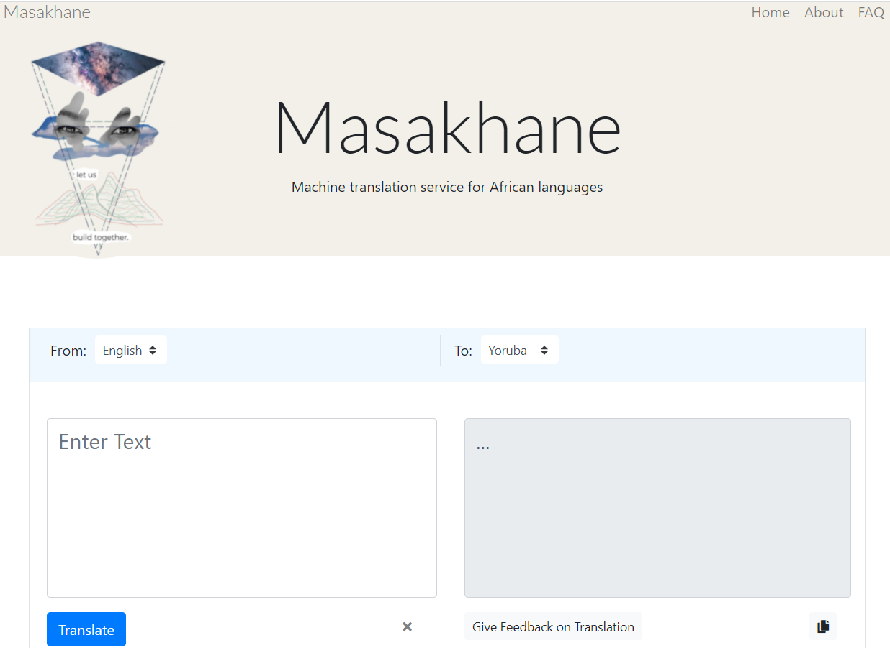






--- 

<link rel="stylesheet" href="/glyphicons/css/glyphicons.css" />

<table style="width:100%">
<col width="20%">
<col width="10">
<col >

<tr style="border-bottom:1pt solid #eee">
<td markdown="1">

</td>
<td></td>
<td markdown="1">
[**Masakhane Web Platform**](http://translate.masakhane.io/)

The project funded by [Mozilla Open Source Support Awards](https://www.mozilla.org/en-US/moss/) to create a web platform simillar to Google translate but for sollenli the African Languages that were made available by the [masakhane community](https://www.masakhane.io/).

<tr style="border-bottom:1pt solid #eee">
<td markdown="1">
<!-- {:class="img-shadow"} -->

</td>
<td></td>
<td markdown="1">
[**Masakhane Initiative**](https://www.masakhane.io/home)

The project consist of putting African researchers from ACROSS the continent together to join the effort in building translation models for African languages. Masakhane means "We Build Together" in isiZRNNulu and was inspired by the [Deep Learning Indaba](http://www.deeplearningindaba.com/) theme for 2018. 
As part of the [team](https://www.masakhane.io/community), I'm working on [Tshiluba](https://en.wikipedia.org/wiki/Luba-Kasai_language).

|| <em class="icon-home"/> || [project page](https://www.masakhane.io/home) || <em class="icon-github"/> || [Github](https://github.com/masakhane-io/masakhane) ||
</td> 
</tr>

<tr style="border-bottom:1pt solid #eee">
<td markdown="1">

</td>
<td></td>
<td markdown="1">
[**A CNN Based Dog Breed Classifier**](https://github.com/Kabongosalomon/CNN-Project-Dog-Breed-Classifier)
In this project, I defined a Convolutional Neural Network that performs better than the average human when given the task of identifying dog breeds in addition, if supplied an image of a human, the code will *also* produce an estimate of the closest-resembling dog breed.

|| <em class="icon-home"/> || [Github](https://github.com/Kabongosalomon/CNN-Project-Dog-Breed-Classifier) ||
</td> 
</tr>

<tr style="border-bottom:1pt solid #eee">
<td markdown="1">

</td>
<td></td>
<td markdown="1">
[**A RNN Based Model : Generate TV Scripts**](https://github.com/Kabongosalomon/Tv-Script-Generation)
Implemented an RNN to generate my own Seinfeld TV scripts using RNNs. I used part of the Seinfeld dataset of scripts from 9 seasons. Using RNN, I generated a new, "fake" TV script, based on patterns it recognizes in this training data.

|| <em class="icon-home"/> || [Github](https://github.com/Kabongosalomon/Tv-Script-Generation) ||
</td> 
</tr>

<tr style="border-bottom:1pt solid #eee">
<td markdown="1">

</td>
<td></td>
<td markdown="1">
[**Generate Faces**](https://github.com/Kabongosalomon/Face-Generation-Project)
Generating images of the face using Deep Convolutional Generative Adversarial Network (DCGAN). The DCGAN is made of a pair of multilayer neural networks that compete against each other until one learns to generate realistic images of faces

|| <em class="icon-home"/> || [Github](https://github.com/Kabongosalomon/Face-Generation-Project) ||
</td> 
</tr>

<!-- 
<tr height="25"/>
<tr style="border-bottom:1pt solid #eee" >
<td markdown="1">
{:class="img-shadow"}
</td>
<td></td>
<td markdown="1">
**AR Camera: An Augmented Reality Prototype for Mobile Devices of Lenovo.**
- Prototyped an application with an AR effect for QR code or a dish of food, to improve user experience.
- Developed detection, tracking and stereo algorithms to obtain a real-time and smooth effect.

|| <em class="icon-film"/> || [video demo](https://youtu.be/XUTCowMHSQs) ||

</td> 
</tr> -->

<!-- </table> -->

